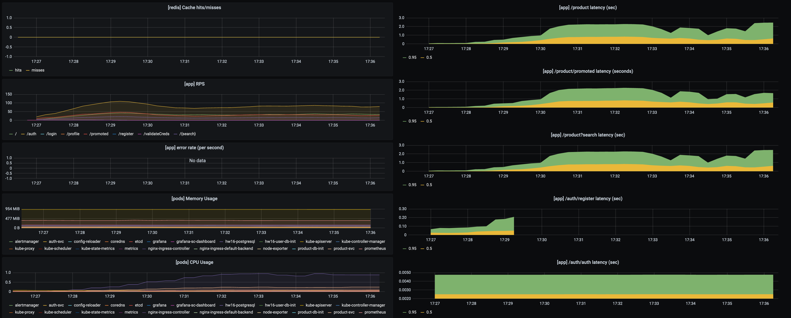
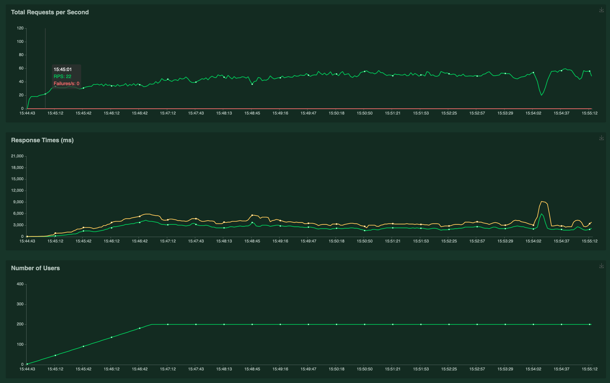
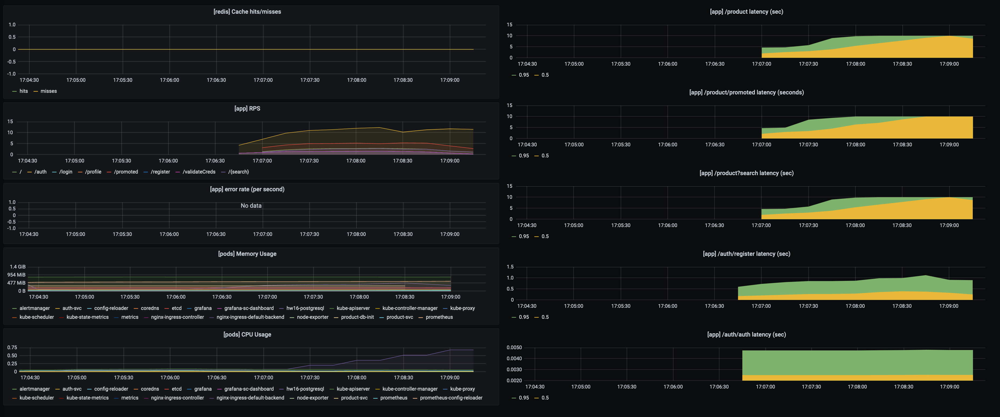

# Как запустить
1. Если prometheus и ingress не установлены, то установить выполнив из папки infra

        ./install_prom.sh && ./install_ingress.sh

1. Установить приложение командой (устанавливается в default namespace)

        helm install hw15 ./chart
        
    или
    
        skaffold run

1. Запустить тесты

        newman run otus-hw15.postman_collection.json

    по-умолчанию запросы идут на arch.homework/otus.
    для изменения можно использовать опцию: 

        --env-var "baseUrl=another.url/app"

1. Посмотреть лог product-service

        kubectl logs pod/<podname>

Product-service пишет в лог информацию о работе с кэшем

# Настройка

Для включения/выключения кэша используется helm value "product.cache.enabled"

# Описание решения
Product-service хранит в БД(postgres) информацию о продуктах и дает возможность работать с ними через api

Для кэширования продуктов используется redis. Данные сохраняются с TTL в одну минуту. Наличие TTL делает данные волатильными с точки зрения redis.
Для redis включена настройка "maxmemory-policy volatile-lru", что означает вытеснение в первую очередь редкоиспользуемых волатильных данных при нехватке памяти.

# Нагрузочное тестирование
## Сценарий
1. Пользователь регистрируется и логинится в систему
1. Через некоторые промежутки времени пользователь либо просматривает список продвигаемых продуктов(сильно чаще), либо ищет продукты по подстроке
1. При просмотре списка пользователь запрашивает детали по продуктам из списка (от нуля до нескольких)

В базу загружено 5000 продуктов. 50 из них - помечены, как продвигаемые (promoted = true)

## Тестирование производительности
Проведено два теста. В обоих интенсивность появления новых пользователей - +1.5 пользователя в секунду.
### С включенным кэшем

Приложение отказало на 220rps и 1950 одновременных пользователей. Существенная деградация производительности - при приближении к 350rps. Отказ - после какого-то времени работы на 350rps.

Рабочая нагрузка - примерно 870 одновременных пользователей или 270rps. При такой нагрузке приложение стабильно и latency не превышает 200ms.

Latency:

Users:

Rps:

### С выключенным кэшем
Приложение отказало на 100rps и 500 одновременных пользователей.

Быстрая деградация производительности началсь с, примерно, 250 одновременных пользователей

Рабочая нагрузка в таком режим - 190-200 одновременных пользователей

### Выводы
Приложение очень зависимо от производительности базы данных и ее диска. Кэширование снимает существенную часть нагрузки на БД и тем самым делает приложение стабильнее

## Объемное тестироване
Проведено три теста: 5к, 62к, 500к продуктов. Кэш везде отключен.

Основной вывод: приложение сильно зависимо от производительности БД. Рекомендуется настройка индексов, возможно использование отдельных систем для организации поиска, использование кэша.

### 5k продуктов

### 62k продуктов

### 500k продуктов

