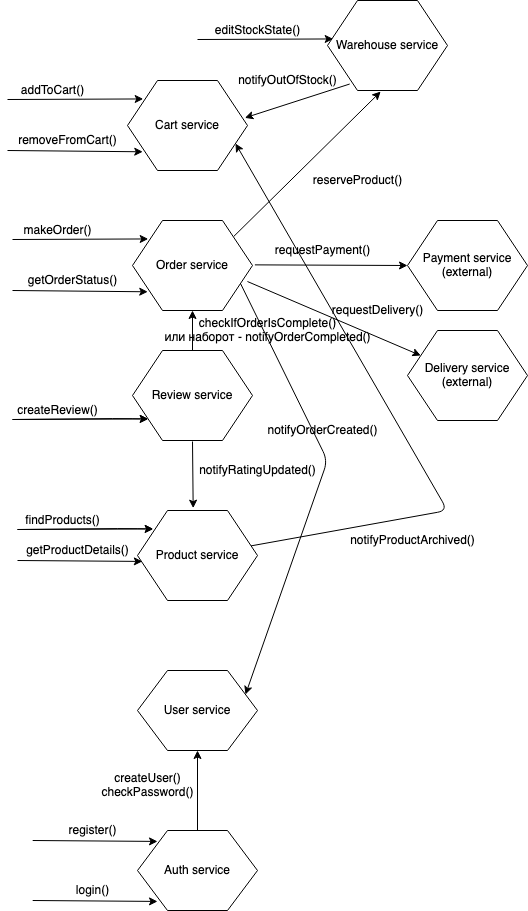

# Сценарии
1. Как покупатель, я хочу иметь возможность просматривать каталог и искать товары

        Given пользователь находится на сайте
        When пользователь заходит в категорию товаров в каталоге
        Then пользователь видит список в данной категории

        Given пользователь находится на сайте
        When пользователь вводит в строку поиска запрос
        Then пользователь получает список товаров подходящих под запрос

1. Как покупатель, я хочу иметь возможность просматривать детальное описание товаров, видеть отзывы других покупателей

        Given пользователь находится на любой странице с карточками товаров
        When пользователь кликает на карточке товара
        Then пользователь видит детальное описание данного товара
            And пользователь видит несколько последних отзывов о товаре
            And пользователь видит рейтинг товара

1. Как покупатель, я хочу иметь возможность выбирать товары для покупки

        Given пользователь находится на любой странице с карточками товаров или в детальном описании товара
        When пользователь кликает на кнопке "добавить в корзину"
            And пользователь вводит желаемое количество товара
        Then товар и количество сохраняется в корзине

        Given пользователь находится на сайте
        When пользователь кликает на кнопку "корзина"
        Then пользователь видит список товаров, добавленных в корзину и их количество
            And пользователь видит стоимость всей корзины

        Given пользователь находится на странице корзины
        When пользователь редактирует количество товара в корзине
        Then пользователь видит обновленную стоимость всей корзины

        Given пользователь находится на странице корзины
        When пользователь нажимает на кнопку "удалить" около товара
        Then товар исчезает из корзины
            And пользователь видит обновленную стоимость всей корзины

        Given пользователь находится на странице корзины
            And выбранный товар закончился на складе
            Or выбранный товар архивирован
        When пользователь нажимает "оформить"
        Then пользователь получает оповещние о недоступных товарах

1. Как покупатель, я хочу иметь возможность купить товары и оформить доставку

        Given пользователь находится на странице корзины
            And корзина не пуста
        When пользователь вводит адрес доставки
            And пользователь вводит email
            And пользователь нажимает на кнопку "оформить"
        Then пользователь видит страницу оплаты

        Given пользователь находится на странице оплаты
        When пользователь вводит данные карты
            And сервис оплаты подтверждает успешую оплату
        Then пользователь получает номер своего заказа
            And пользователь получает пароль от личного кабинета на email

1. Как покупатель, я хочу иметь возможность отслеживать статус своего заказа

        Given пользователь находится на сайте
            And пользователь делал заказ
        When пользователь заходит в список своих заказов
        Then пользователь видит статус каждого заказа

1. Как покупатель, я хочу иметь возможность оставить отзыв о заказе

        Given пользователь находится на странице своих заказов
            And пользователь не оставлял отзыв о купленном товаре
        When пользователь нажимает на кнопку "отзыв"
            And пользователь выставляет оценку
            And пользователь вводит комментарий
        Then система учитывает оценку в рейтинге
            And другие пользователи видят данный комментарий

1. Как менеджер магазина, я хочу иметь возможность добавлять/удалять/редактировать товары в каталоге

        Given менеджер магазина находится на сайте
        When менеджер магазина нажимает кнопку "редактировать" в описании товара
            And менеджер магазина изменяет описание и другие параметры
            And нажимает "сохранить"
        Then изменения видят все пользователи

        Given менеджер магазина находится на сайте
        When менеджер магазина нажимает "добавить товар"
            And вводит все параметры товара
        Then новый товар видят все пользователи

        Given менеджер магазина находится на сайте
        When менеджер магазина нажимает "архивировать" на карточке товара
        Then пользователи больше не видят этот товар в списках

1. Как менеджер склада, я хочу иметь возможность управлять наличием товаров на складе

        Given менеджер склада находится на странице описания товара
        When менеджер склада нажимает "редактировать"
            And вводит количество
        Then пользователи видят актуальное количество товара

# Системные действия
1. Пользователь ищет и просматривает товары
1. Пользователь изменяет корзину
1. Пользователь оформляет и оплачивает заказ
1. Пользователь просматривает статус заказа
1. Пользователь оставляет отзыв о товаре
1. Менеджер магазина изменяет описание товаров
1. Менеджер склада изменяет количество товара в наличии

# Модель предметной области

# Сервисная модель

# Сервисы
## auth
Хранение сессий, авторизацию запросов

## user
Хранение информации о пользователе (в т.ч. информация о пароле)

## product
Хранение каталога продуктов, поиск продуктов, вычисление и хранение рейтинга продукта (на основе события "добавлен отзыв" от сервиса review)

## order
Хранение информации о заказе(состав, статус, детали доставки).
Взаимодействие с внешними системами:
- запрашивает страницу платежа у payment service и ожидает подтверждения
- помещает заявку на доставку в delivery service

## cart
Хранение состояния корзины.
Слушает события "продукт кончился на складе" и "продукт заархивирован", чтобы во-время сделать корзину актуальной

## review
Хранение и ранжирование отзывов. Слушает событие "заказ выполнен", чтобы только после выполнения заказа давать пользователю доступ к написанию отзыва. (другой вариант - при попытке написать отзыв запрашивать статус заказа у order service)

## warehouse
Хранит информацию о количестве товара на складе. Хранит информации о резерве(служба доставки получает товар со склада по номеру резерва).
