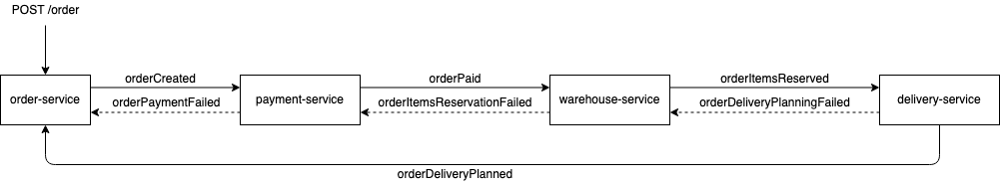

# Как запустить
1. Если ingress не установлен, то установить выполнив из папки infra

        ./install_ingress.sh

1. Установить приложение командой (устанавливается в default namespace)

        helm install hw21 ./chart
        
    или
    
        skaffold run

1. Запустить тесты

        newman run otus-hw21.postman_collection.json

    по-умолчанию запросы идут на arch.homework/otus.
    для изменения можно использовать опцию: 

        --env-var "baseUrl=another.url/app"

# Описание
Реализована хореографическая сага.

1. Запрос на создание заказа приходит в сервис order-service.
1. order-service создает заказ в статусе pending. кидает сообщение об успешном создании заказа
1. payment-service по этому событию начинает процесс оплаты. далее кидает сообщение об успехе
1. warehouse-service по событию об успешной оплате создает резерв на складе. далее кидает сообщение об успехе
1. delivery-service по событию об успешном резерве добавляет запись о планируемой доставке.

В случае провала одного из шагов вся транзакция откатывается - выполняются компенсирующие действия в обратном порядке.

Для тестирования на склад добавлен только товар с id 42. При попытке резерва любого другого товара транзакция откатывается и заказ переводится в статус cancelled.

